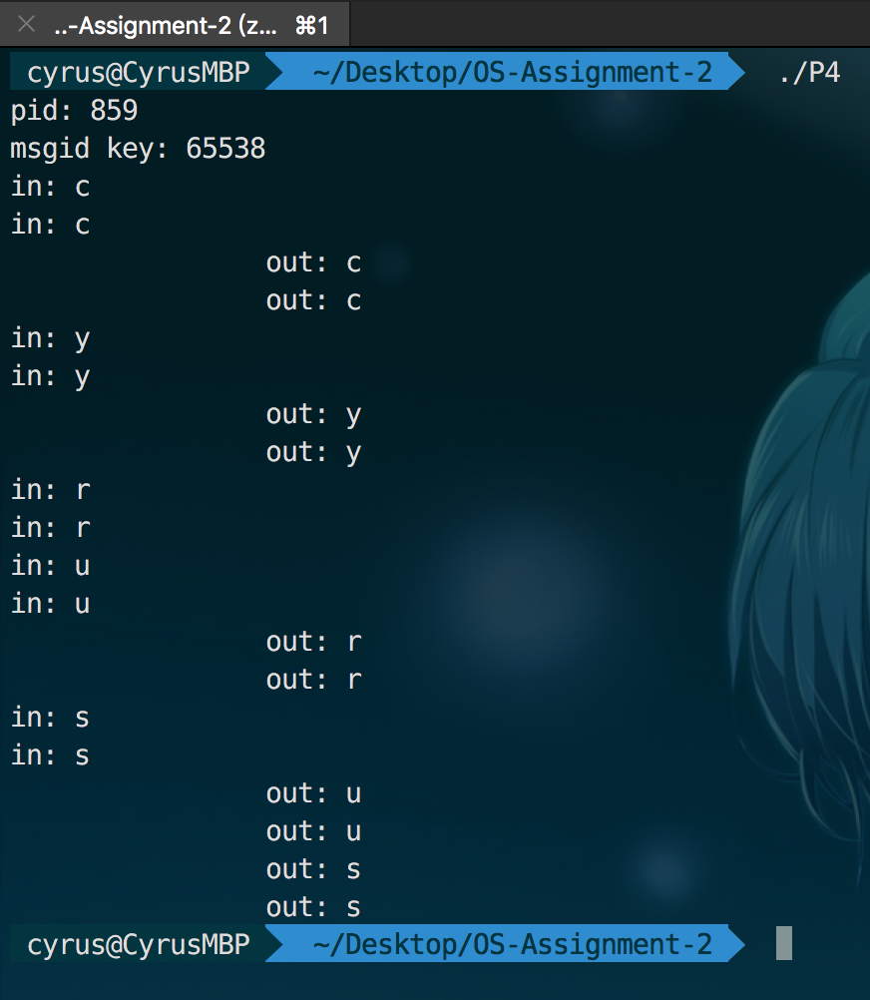
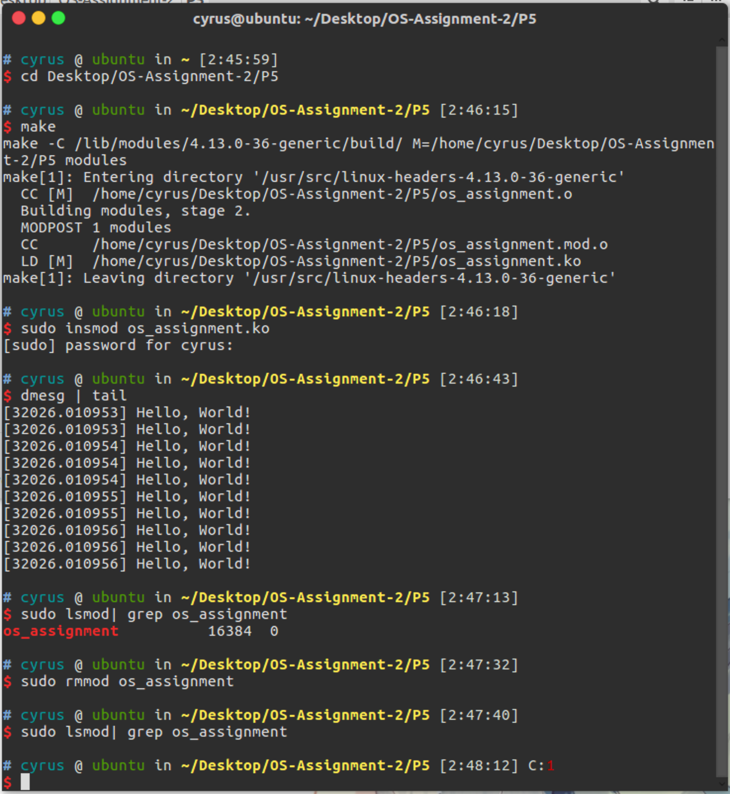

# OS Assignment 2

## Problem 1

在Linux操作系统中实现2.1节中例子，运行多次，每次的结果有什么不同？

**Codes :**

```C
#include <pthread.h>
#include <stdio.h>

int n = 0;

void *A(void *arg) {
	while (1) {
		n++;
	}
}

void *B(void *arg) {
	while (1) {
		printf("%d\n", n);
		n = 0;
	}
}


int main(void) {
	pthread_t p1, p2;
	pthread_create(&p1, NULL, A, NULL);
	pthread_create(&p2, NULL, B, NULL);
	pthread_join(p1, NULL);
	pthread_join(p2, NULL);
}
```

**Result 1:**


**Result 2:**


## Problem 2

阅读Linux3.0以上版本的内核代码中进程控制块和进程调度的代码，然后回答下面的问题：

™Linux的进程控制块的组织方式是什么？

™请问它里面设定了那些进程状态，这些状态代表什么意义？

™状态之间如何转换？并画出状态转换图。

####Linux的进程控制块的组织方式是什么？

Linux 使用了一个双向循环列表来组织PCB。这个双向循环列表的头和尾都是一个叫做 `init_task` 的， pid 为 0 的 PCB ( https://github.com/torvalds/linux/blob/e0d072250a54669dce876d8ade70e417356aae74/init/init_task.c#L19 )。
Linux 中也有一个单独的运行队列，只存放处于 TASK_RUNNING 状态的进程，使用双向循环列表实现。
还有一个等待队列，由循环列表实现。

####请问它里面设定了那些进程状态，这些状态代表什么意义？

```c
#define TASK_RUNNING		0
#define TASK_INTERRUPTIBLE	1
#define TASK_UNINTERRUPTIBLE	2
#define __TASK_STOPPED		4
#define __TASK_TRACED		8
/* in tsk->exit_state */
#define EXIT_ZOMBIE		16
#define EXIT_DEAD		32
```

- TASK_RUNNING: 进程正在执行或者正在准备执行
- TASK_INTERRUPTIBLE： 可中断的阻塞状态
- TASK_UNINTERRUPTIBLE： 不可中断的阻塞状态
- __TASK_STOPPED: 收到SIGSTOP、SIGTSTP、SIGTTIN、SIGTTOUT等信号
- __TASK_TRACED： 使用 gdb 跟踪进程
- EXIT_DEAD： 进程死掉了
- EXIT_ZOMBIE：进程死掉了，父进程忽略了他的退出信号，成为僵尸进程

####状态之间如何转换？并画出状态转换图？


## Problem 3

**Codes :**

```C
#include <stdio.h>
#include <unistd.h>
#include <sys/wait.h>

int main(void) {
	
	int child;
	
	char * argv[] = {"echo", "Hello, World!", NULL};
	char * envp[] = {NULL};
	
	if (!(child = fork())) {
		printf("pid %d: pid %d is my father\n", getpid(), getppid());
		execve("/bin/echo", argv, envp);
		printf("pid %d: I'm back, something is wrong!\n", getpid());
	} else {
		int selfpid = getpid();
		printf("pid %d: pid %d is my son\n", selfpid, child);
		wait4(child, NULL, 0, NULL);
		printf("pid %d: done\n", selfpid);
	}
}
```

**Result :**


在以上代码中，可以将 Line 19 改为以下语句来使用 wait4 或 waitpid：

```C
wait3(&child, 0, NULL);
```

```C
waitpid(child, &selfpid, 0);
```

## Problem 4

用LINUX的消息队列机制编程实现生产者-消费者问题。

**Codes :**

```C
#include <pthread.h>
#include <stdio.h>
#include <sys/msg.h>
#include <unistd.h>

typedef struct {
	long msgtype;
	char msg;
} Message;

int msgid;
int MSGSZ = 1;
int MSGTYPE = 233;

void productor(void *arg) {
	Message msg;
	msg.msgtype = MSGTYPE;  
	FILE *fp;
	fp = fopen("test.txt", "r");
	char ch;
	while ((ch = fgetc(fp)) != EOF) {
		msg.msg = ch;
		msgsnd(msgid, &msg, MSGSZ, 0);
		printf("in: %c\n", msg.msg);
		sleep(1);
	}
}

void consumer(void *arg) {
	Message msg;
	int ret;
	while (1) {
		ret = msgrcv(msgid, &msg, MSGSZ, MSGTYPE, IPC_NOWAIT);
		if (ret != -1) {
			printf("\t\tout: %c\n", msg.msg);
		} else {
			break;
		}
		sleep(2);
	}
}

int main() {
	int productor_N = 2;
	int consumer_N = 3;
	pthread_t ps[productor_N], cs[consumer_N];
	int selfpid = getpid();
	printf("pid: %d\n", selfpid);
	msgid = msgget(selfpid, IPC_CREAT | 0666);
	printf("msgid key: %d\n", msgid);

	for (int i = 0; i < productor_N; i++) {
		pthread_create(&ps[i], NULL, (void *)productor, NULL);
	}
	for (int i = 0; i < consumer_N; i++) {
		pthread_create(&cs[i], NULL, (void *)consumer, NULL);
	}

	for (int i = 0; i < productor_N; i++) {
		pthread_join(ps[i], NULL);
	}
	for (int i = 0; i < consumer_N; i++) {
		pthread_join(cs[i], NULL);
	}
}
```

**Result :**



`test.txt` 文件中的内容为：

```
cyrus
```

## Problem 5

利用上面提到的系统调用，在Linux系统中实现一个可加载的内核模块，里面至少包含一个内核线程。

**os_assignment.c**

```C
#include <linux/init.h>
#include <linux/kthread.h>
#include <linux/module.h>
#include <linux/delay.h>

static struct task_struct *tsk;

static int thread_function(void *data) {
	int time_count = 0;
	do {
		printk(KERN_INFO "Hello, World!");
		msleep(1000);
	} while (!kthread_should_stop() && time_count <= 15);
	return time_count;
}

static int hello_init(void) {
	tsk = kthread_run(thread_function, NULL, "mythread%d", 1);
	return 0;
}

static void hello_exit(void) {
	if (!IS_ERR(tsk)) {
		int ret = kthread_stop(tsk);
		printk(KERN_INFO "thread function has run %ds\n", ret);
	}
}

module_init(hello_init);
module_exit(hello_exit);
```

**Makefile**

```makefile
obj-m+=os_assignment.o

all:
		make -C /lib/modules/$(shell uname -r)/build/ M=$(PWD) modules
clean:
		make -C /lib/modules/$(shell uname -r)/build/ M=$(PWD) clean
```

**Result :**




注：除 Problem 5 的编译和测试环境为 Ubuntu，其余均为 MacOS。